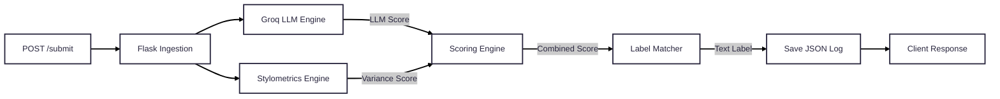
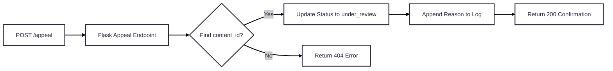

# Provenance Guard

Creative platforms — the ones where people share writing, music, poetry, personal essays — are facing a trust problem. When someone posts original work, there's no reliable way for audiences to know whether it was genuinely made by that person or generated by AI and submitted as their own. This isn't about policing creativity or banning AI tools. It's about attribution: giving readers the context they need, protecting creators who do the work, and building a platform where authenticity means something.

Provenance Guard is a backend classification system designed to plug into any creative-sharing platform. When a creator submits text, the system runs two independent detection signals, combines them into a weighted confidence score, maps that score to a plain-language transparency label, and logs the result to an audit ledger. If a creator believes they've been misclassified, they can submit an appeal that flags the entry for human review. The entire pipeline runs per-request with no database required — just a Flask API, the Groq LLM, and a local JSON log file.

---

## Table of Contents

1. [Architecture](#architecture)
2. [API Endpoints](#api-endpoints)
3. [Detection Signals](#detection-signals)
4. [Confidence Scoring](#confidence-scoring)
5. [Transparency Labels](#transparency-labels)
6. [Appeals Workflow](#appeals-workflow)
7. [Rate Limiting](#rate-limiting)
8. [Known Limitations](#known-limitations)
9. [Spec Reflection](#spec-reflection)
10. [AI Usage](#ai-usage)
11. [Portfolio Walkthrough](#portfolio-walkthrough)
12. [Setup](#setup)

---

## Architecture

When a text is submitted via `POST /submit`, the application routes the raw text simultaneously to two independent engines: the Groq LLM handler (Signal 1) and the local stylometric math function (Signal 2). The resulting scores are fed into a weighted formula to produce a final confidence score, which is mapped to a transparency label, written to the audit log, and returned to the caller.

### Submission Flow



### Appeal Flow



---

## API Endpoints

| Method | Route | Description |
|--------|-------|-------------|
| `POST` | `/submit` | Analyze text and return an attribution verdict |
| `POST` | `/appeal` | Contest a classification by content_id |
| `GET` | `/log` | Return all audit log entries |

### `POST /submit`

**Request**
```json
{
  "text": "string",
  "creator_id": "string"
}
```

**Response `200 OK`**
```json
{
  "content_id": "af9376d7-378b-4242-b784-694fea23b2b9",
  "attribution": "likely_ai",
  "confidence": 0.9198,
  "llm_score": 0.87,
  "stylometric_score": 0.9944,
  "label": "AI-Generated: This content displays high predictability and structural regularity characteristic of automated text models."
}
```

### `POST /appeal`

**Request**
```json
{
  "content_id": "string",
  "creator_reasoning": "string"
}
```

**Response `200 OK`**
```json
{
  "message": "Appeal received. Entry is now under review.",
  "content_id": "af9376d7-378b-4242-b784-694fea23b2b9"
}
```

### `GET /log`

**Response `200 OK`**
```json
{
  "entries": [
    {
      "content_id": "af9376d7-378b-4242-b784-694fea23b2b9",
      "creator_id": "user_99",
      "timestamp": "2026-06-29T04:01:28.626498+00:00",
      "attribution": "likely_ai",
      "confidence": 0.9198,
      "llm_score": 0.87,
      "stylometric_score": 0.9944,
      "status": "classified"
    }
  ]
}
```

---

## Detection Signals

The system combines two signals that measure different properties of the text. Neither signal alone is reliable enough — the LLM can be fooled by stylized human writing, and pure stylometrics can falsely flag structured academic prose. Running them together and weighting appropriately reduces both failure modes.

### Signal 1 — Groq LLM Semantic Analysis (weight: 0.60)

The LLM signal evaluates semantic-level patterns: how predictable the vocabulary is, whether tonal register stays flat across the text, and whether the writing relies on common AI transition phrases ("Furthermore," "In conclusion," "It is worth noting"). These are things a statistical variance measure can't catch.

The Groq API call uses `llama-3.3-70b-versatile` with `response_format={"type": "json_object"}` to force structured output. The system prompt instructs the model to return only `{"ai_probability": <float>}` with no explanation. The returned float is clamped to `[0.0, 1.0]` and falls back to `0.5` on any API or parse failure.

**Output:** Float `0.0` (human) → `1.0` (AI)

### Signal 2 — Stylometric Sentence Length Variance (weight: 0.40)

The stylometric signal measures how rhythmically uniform the text is at the structural level. It splits text on sentence-ending punctuation, counts words per sentence, and computes population variance across those counts. Human writing naturally swings between short punchy sentences and long clause-heavy ones. AI text tends to converge on a consistent sentence length.

Raw variance is normalized against a practical ceiling of 100 (word²) and then inverted — so high variance (human) yields a score near `0.0`, and low variance (AI) yields a score near `1.0`. Inputs with fewer than 2 sentences return a neutral `0.5`.

**Output:** Float `0.0` (high variance / human) → `1.0` (low variance / AI)

### Why These Two Signals

The LLM catches semantic and tonal patterns that are invisible to statistics. The stylometric function catches structural regularity that an LLM might miss when the vocabulary is deliberately varied. Together they cover two independent dimensions of AI-generated text, which is why a weighted combination is more reliable than either one alone.

The LLM carries 60% of the weight (adjusted from the original 55/45 spec split — see [Spec Reflection](#spec-reflection)) because semantic pattern matching is the more informative signal. Structural variance is a meaningful secondary indicator but can be high even in AI text if the model was prompted to vary its sentences, so it carries less weight.

---

## Confidence Scoring

### Formula

```
Final Score = (LLM Score × 0.60) + (Stylometric Score × 0.40)
```

### Thresholds

| Score Range | Attribution Flag |
|-------------|-----------------|
| `0.00 – 0.39` | `likely_human` |
| `0.40 – 0.70` | `uncertain` |
| `0.71 – 1.00` | `likely_ai` |

The thresholds deliberately avoid a 0.5 binary flip. A score of 0.4 represents real ambiguity — the system detected some signal but not enough to confidently call it either way. Forcing a binary decision in that range would produce false accusations against authentic creators.

### Live Examples

**High-Confidence AI — score `0.9198`**

Input:
> "Blockchain technology is revolutionizing the financial sector. It provides decentralized solutions for secure transactions. Organizations are increasingly adopting blockchain to enhance transparency. The technology offers immutable record-keeping capabilities. Furthermore, smart contracts automate complex business processes efficiently."

```json
{
  "attribution": "likely_ai",
  "confidence": 0.9198,
  "llm_score": 0.87,
  "stylometric_score": 0.9944
}
```

Both signals fired strongly. The LLM flagged heavy use of AI transition words ("Furthermore," "increasingly," "immutable") and flat tonal uniformity. The stylometric score of `0.9944` is near-maximum — every sentence in this block is essentially the same length, which is a structural fingerprint of AI generation.

---

**High-Confidence Human — score `0.367`**

Input:
> "ok so I was literally about to give up on this essay. like completely. but then I remembered that one thing my professor said—something about just writing ANYTHING down first?? idk. anyway here I am at 2am typing this. my dog keeps barking. the essay is due in 6 hours lmao send help."

```json
{
  "attribution": "likely_human",
  "confidence": 0.367,
  "llm_score": 0.12,
  "stylometric_score": 0.7376
}
```

The LLM scored this extremely low — the informal register, incomplete thoughts, and self-interruptions are nothing like AI output patterns. The stylometric score of `0.7376` is notable: even though the sentences vary considerably, they don't swing as wildly as pure short-burst writing, so the signal lands in the moderate range. The LLM signal (60% weight) pulled the combined score comfortably below the uncertain threshold.

---

**Uncertain — score `0.603`**

Input:
> "The relationship between technology and society has always been complex. Early industrialization brought both prosperity and displacement. Workers lost traditional crafts but gained factory wages. Today, artificial intelligence presents a similar paradox — enormous efficiency gains alongside genuine fears of obsolescence. Some economists argue the transition will be painful but ultimately beneficial. Others are not so sure."

```json
{
  "attribution": "uncertain",
  "confidence": 0.603,
  "llm_score": 0.42,
  "stylometric_score": 0.8775
}
```

This is exactly the tension the uncertain bucket is designed to capture. The LLM gave a moderate score — the text is structured and uses formal vocabulary, but also includes a short punchy closer ("Others are not so sure.") that breaks the uniformity. The stylometric score is high because most sentences cluster around a similar length. A human writing a polished essay could produce this exact pattern. So could an AI asked to vary its output. The system correctly declines to pick a side.

---

## Transparency Labels

Every submission returns one of three exact label strings displayed to the end user.

**High-Confidence Human** (`confidence 0.00 – 0.39`):
> Human Generated: This content matches natural human writing patterns with high structural diversity and authenticity.

**Uncertain** (`confidence 0.40 – 0.70`):
> Unverified Attribution: This text exhibits mixed stylistic patterns, combining automated uniformity with creative variation.

**High-Confidence AI** (`confidence 0.71 – 1.00`):
> AI-Generated: This content displays high predictability and structural regularity characteristic of automated text models.

---

## Appeals Workflow

Any creator whose content receives an `uncertain` or `likely_ai` label can file an appeal.

**Who can appeal:** Any creator with a `content_id` from a prior submission.

**What they provide:** The `content_id` and a written explanation of why the classification is wrong.

**What the system does:**
1. Receives the request at `POST /appeal`
2. Searches the audit log for the matching `content_id`
3. Updates the entry's `status` from `"classified"` to `"under_review"`
4. Appends `creator_reasoning` and an `appealed_at` ISO timestamp to that record
5. Returns `200 OK` if found, `404` if not

**Reviewer view:** A human administrator querying `GET /log` filters for `status == "under_review"` to see all contested entries alongside their original signal scores and the creator's defense.

---

## Rate Limiting

`POST /submit` is protected by Flask-Limiter with in-memory storage:

- **10 requests per minute**
- **100 requests per day**

Requests exceeding the threshold return `429 Too Many Requests`. No other endpoints are rate-limited.

To verify rate limiting is working, send 12 rapid requests — you should see 10 `200` responses followed by 2 `429` responses:

```bash
for i in $(seq 1 12); do
  curl -s -w "\nHTTP %{http_code}\n" -X POST http://localhost:5001/submit \
    -H "Content-Type: application/json" \
    -d '{"text": "Test submission for rate limit testing.", "creator_id": "ratelimit-test"}'
done
```

---

## Known Limitations

**Polished academic and technical writing will generate false AI flags.** This is the most predictable failure mode of the current system, and it's a direct consequence of how Signal 2 is designed. Human-written research papers and technical essays intentionally follow structured conventions: consistent paragraph length, formal transition language, controlled vocabulary. Both signals read these conventions as AI indicators. A senior academic writing in their own authentic voice could easily score in the `uncertain` or even `likely_ai` range. The fix isn't more data — it's a third signal that can account for domain register, perhaps by checking whether vocabulary diversity and domain-specific terminology patterns are consistent with genuine expertise rather than generic fluency.

**Short inputs are structurally unreliable.** Signal 2 returns a neutral `0.5` for any input under two sentences, which means the combined score defaults to being 60% LLM-driven. For poetry or short-form content this is unavoidable, but it means the system is making a meaningful classification with half its sensing capability disabled.

**The LLM signal is non-deterministic.** The same text submitted twice may return slightly different `llm_score` values, which can flip borderline cases between attribution buckets. In a production system this would need to be addressed with temperature locking, ensemble voting across multiple calls, or a cached score keyed to a text hash.

---

## Spec Reflection

**Where the spec helped:** The three-bracket threshold design in the planning doc — `likely_human` / `uncertain` / `likely_ai` — was the right call from the start and I didn't change it. Having the `uncertain` bucket explicitly planned before writing a single line of code meant the scoring logic had a clear target: don't force a binary decision when the signals conflict. It also made the label copy easier to write because each bucket had a distinct meaning to communicate, not just a number to display.

**Where I diverged:** The original spec set the combination weights at 55/45 (LLM / stylometric). During testing I changed these to 60/40. The stylometric signal turned out to be less discriminating than expected because it only measures sentence length — it can't distinguish between a human who writes in consistent medium-length sentences and an AI that was prompted to vary its output. Giving it 45% of the final score was overstating its reliability. Dropping it to 40% kept it as a meaningful secondary signal without letting it swing borderline cases the wrong way.

---

## AI Usage

**1. Generating the initial app.py from spec constraints**

I provided the AI with the architecture narrative, the exact signal specifications, the combination formula, the threshold brackets, the label copy, the rate limiting parameters, and the audit log schema from the planning doc. The AI produced a working single-file Flask implementation that matched all of those constraints. I then revised every line of code to verify it worked as intended — tracing through the logic for the Groq API call, the JSON parsing and fallback, the stylometric variance normalization and inversion, the scoring formula, the audit log read/write cycle, and the appeal route's in-place mutation of the entries list. The AI got the structure right; I confirmed the behavior was correct.

**2. Brainstorming and structuring the planning doc**

I used the AI to help develop the planning.md before writing any code. Crucially, I didn't just ask it to produce a plan — I made it question its own decisions and explain the reasoning behind each one. Why this weighting and not another? Why these threshold boundaries and not 0.5 / 0.75? What would break in each edge case? That process of making the AI defend its choices was how I caught the 55/45 weighting issue early — the AI's own explanation of why Signal 2 was weighted at 45% wasn't convincing once I pushed on it, which is what led me to adjust it to 40% after testing.

---

## Portfolio Walkthrough

[[[Loom walkthrough — link coming soon]](https://www.loom.com/share/18f41f97464344038db05a3dac909f6f)
](https://www.loom.com/share/18f41f97464344038db05a3dac909f6f)

A short end-to-end demo covering: submitting texts across all three classification outcomes, reading the audit log, filing an appeal and confirming the status update, and hitting the rate limit.

---

## Setup

**Prerequisites:** Python 3.10+, a Groq API key

```bash
# Clone and enter the repo
git clone <repo-url>
cd ai201-project4-provenance-guard-1

# Create and activate virtual environment
python3 -m venv .venv
source .venv/bin/activate

# Install dependencies
pip install -r requirements.txt

# Add your Groq API key
echo "GROQ_API_KEY=your_key_here" > .env

# Run the server
python app.py
```

The server starts on `http://localhost:5001`.

**Dependencies:** `flask`, `flask-limiter`, `groq`, `python-dotenv`
